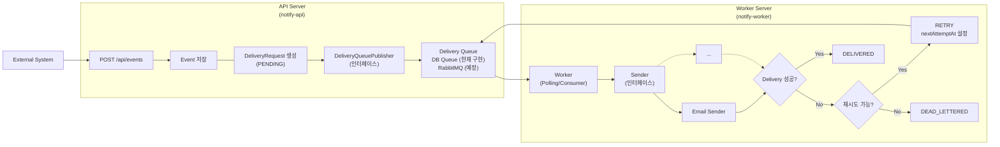

## NotifyRail

> 이벤트 기반 알림 전달 플랫폼  
> Reliable event-driven notification delivery platform


## 소개

NotifyRail은 외부 시스템에서 발생한 이벤트를 수신하고, 이메일 또는 웹훅 같은 채널을 통해 알림을 안정적으로 발송하는 이벤트 기반 알림 전달 플랫폼입니다.

단순한 알림 발송 기능보다, 실제 운영 환경에서 필요한 비동기 처리, 재시도, 멱등성 보장, Dead Letter 처리, 발송 이력 추적에 초점을 맞췄습니다.

## 기술 스택

| 영역            | 기술                           | 사용 이유                |
|---------------|------------------------------|----------------------|
| Backend       | Spring Boot                  | REST API와 비즈니스 로직 구현 |
| Persistence   | Spring Data JPA, MySQL       | 이벤트와 발송 이력의 영속 저장    |
| Queue         | RabbitMQ 또는 DB               | 발송 작업의 비동기 처리        |
| Frontend      | Vue.js, TypeScript           | 관리자 대시보드 구현          |
| Infra         | Docker Compose               | 로컬 개발 환경 구성          |
| Observability | Actuator, structured logging | 상태 확인과 장애 분석         |

## API 사용 예시

### 이벤트 수신

외부 시스템은 `POST /api/events`로 알림 이벤트를 전송합니다. API는 이벤트와 발송 요청을 저장한 뒤 `202 Accepted`를 반환하고, 실제 발송은 워커가 비동기로 처리합니다.

```bash
curl -X POST http://localhost:8080/api/events \
  -H "Content-Type: application/json" \
  -d '{
    "source": "order-service",
    "eventType": "ORDER_COMPLETED",
    "idempotencyKey": "order-10001-completed",
    "recipients": [
      {
        "channel": "EMAIL",
        "target": "user@example.com"
      }
    ],
    "payload": {
      "orderId": 10001,
      "customerName": "홍길동",
      "totalAmount": 39000
    }
  }'
```

응답 예시:

```http
HTTP/1.1 202 Accepted
Content-Type: application/json

{
  "eventKey": "7f40fd8d-8168-4b57-99b6-d0c583de1c5f"
}
```

동일한 `source`와 `idempotencyKey`로 다시 요청하면 새 발송 요청을 만들지 않고 기존 이벤트를 반환합니다.

> 현재 MVP에서는 로컬 실행과 핵심 발송 흐름 검증에 집중하기 위해 인증을 적용하지 않았습니다.<br/>
> 추후 호출 시스템별 API Key 또는 HMAC 서명 기반 인증을 추가해 이벤트 수신 API의 호출 주체를 검증할 예정입니다.

## 처리 흐름

NotifyRail은 이벤트 수신 API와 실제 발송 워커를 분리해, 외부 채널 장애가 API 응답 흐름에 직접 영향을 주지 않도록 구성합니다.
현재는 DB 기반 큐를 사용하지만, 발행부는 `DeliveryQueuePublisher` 인터페이스로 분리해 추후 RabbitMQ 같은 메시지 브로커로 교체할 수 있도록 설계했습니다.



## 핵심 설계 포인트

### 큐 기반 비동기 처리

이벤트 수신과 실제 알림 발송을 분리하여 API 응답 지연을 줄이고, 외부 채널 장애가 전체 요청 처리에 영향을 주지 않도록 설계했습니다.

### 멱등성 처리

클라이언트가 동일한 Idempotency Key로 이벤트를 다시 전송하면 중복 발송 요청을 생성하지 않고 기존 이벤트를 반환합니다.

### 실패 재시도

일시적인 네트워크 오류나 외부 API 장애는 즉시 실패로 확정하지 않고, 정해진 재시도 정책에 따라 다시 발송합니다.

### Dead Letter 처리

최대 재시도 횟수를 초과한 발송 요청은 Dead Letter 상태로 분리하여 운영자가 실패 원인을 확인하고 후속 조치를 할 수 있도록 했습니다.

### 발송 상태 추적

이벤트, 발송 요청, 발송 시도를 분리해 어떤 이벤트가 어떤 채널로 몇 번 시도되었고 왜 실패했는지 추적할 수 있도록 했습니다.
