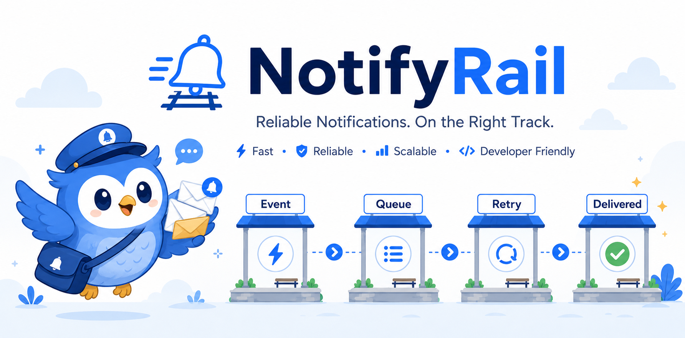
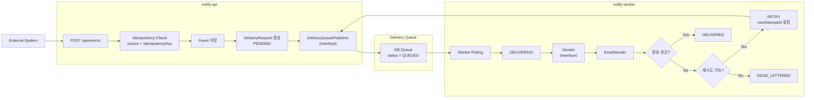

# NotifyRail

> 이벤트 기반 알림 전달 플랫폼  
> Reliable event-driven notification delivery platform



## 소개

NotifyRail은 외부 시스템에서 발생한 이벤트를 수신하고, 알림 채널로 안정적으로 발송하는 이벤트 기반 알림 전달 플랫폼입니다.

단순 발송 기능보다 비동기 처리, 멱등성, 재시도, Dead Letter, 발송 상태 추적처럼 실제 **운영 환경에서 필요한 백엔드 설계 요소**를 보여주는 데 초점을 맞췄습니다.

## 기술 스택

| 영역          | 기술                     | 사용 목적                                                |
|-------------|------------------------|------------------------------------------------------|
| Language    | Java 21                | 백엔드 API와 Worker 구현                                   |
| Framework   | Spring Boot 4.0.6      | 애플리케이션 구성, REST API, 스케줄링 기반 Worker 실행               |
| Web         | Spring Web MVC         | 이벤트 수신 API 구현                                        |
| Persistence | Spring Data JPA, MySQL | 이벤트와 발송 요청, 발송 상태 저장                                 |
| Queue       | DB Queue               | `DeliveryRequest` 상태값 기반 비동기 발송 처리                   |
| Mail        | Spring Mail            | 이메일 발송 채널 구현                                         |
| Validation  | Spring Validation      | 이벤트 수신 요청의 필수값, payload, 수신자 중복 검증                   |
| Build       | Gradle Multi-Module    | `notify-api`, `notify-worker`, `notify-domain` 모듈 분리 |
| Infra       | Docker Compose         | 로컬 MySQL 실행 환경 구성                                    |

### 향후 도입 예정

| 영역             | 기술                            | 목적                                  |
|----------------|-------------------------------|-------------------------------------|
| Message Broker | RabbitMQ                      | DB Queue를 대체해 작업 큐 기반 비동기 발송 구조 구현  |
| Frontend       | Vue.js, TypeScript            | 이벤트, 발송 요청, 실패 내역을 확인하는 관리자 대시보드 구현 |
| Observability  | Actuator, Prometheus, Grafana | 운영 상태 확인, 메트릭 수집, 대시보드 시각화          |

> Apache Kafka보다 RabbitMQ를 우선 고려합니다.<br/>
> 핵심 요구는 개별 발송 작업을 큐에 넣고 Worker가 처리하며 재시도와 Dead Letter로 분리하는 작업 큐 패턴에 가깝기 때문입니다.

## 아키텍처

> 현재 MVP에서는 메시지 브로커 대신 DB 테이블의 상태값을 큐처럼 사용하는 DB Queue 방식으로 구현했습니다.<br/>
> 큐 발행을 `DeliveryQueuePublisher` 인터페이스로 분리해, 이후 RabbitMQ 같은 메시지 브로커로 교체할 수 있도록 설계했습니다.

NotifyRail은 이벤트를 수신하는 API 서버와 실제 알림을 발송하는 Worker 서버를 분리한 구조입니다.<br/>
API는 이벤트와 발송 요청을 저장한 뒤 빠르게 `202 Accepted`를 반환하고, <br/>
Worker는 큐에 적재된 발송 요청을 비동기로 처리합니다.

### 모듈 구성

| 모듈              | 역할                                                                       |
|-----------------|--------------------------------------------------------------------------|
| `notify-domain` | `Event`, `DeliveryRequest` 같은 공통 도메인 엔티티와 상태 enum을 관리합니다.                |
| `notify-api`    | 외부 이벤트 수신 API를 제공하고, 멱등성 검증 후 이벤트와 발송 요청을 저장합니다.                         |
| `notify-worker` | 큐에 적재된 발송 요청을 조회해 채널별 `Sender`로 발송하고, 실패 시 재시도 또는 Dead Letter 상태로 전환합니다. |

### 전체 처리 흐름



### 상태 전이

발송 요청은 다음 상태를 기준으로 처리됩니다.

```text
PENDING -> QUEUED -> DELIVERING -> DELIVERED
                         |
                         v
                       RETRY -> QUEUED
                         |
                         v
                    DEAD_LETTERED
```

- `PENDING`: 이벤트 수신 후 발송 요청이 생성된 상태입니다.
- `QUEUED`: 큐에 발행되어 Worker가 처리할 수 있는 상태입니다.
- `DELIVERING`: Worker가 발송을 시도 중인 상태입니다.
- `RETRY`: 발송 실패 후 재시도 예정인 상태입니다. 현재는 1분 뒤 다시 큐에 발행됩니다.
- `DELIVERED`: 발송에 성공한 최종 상태입니다.
- `DEAD_LETTERED`: 최대 재시도 횟수를 초과해 더 이상 자동 발송하지 않는 최종 실패 상태입니다.

### 주요 확장 지점

- `DeliveryQueuePublisher`를 통해 현재 DB Queue 구현을 RabbitMQ 같은 메시지 브로커로 교체할 수 있습니다.
- `Sender` 인터페이스를 통해 현재 이메일, Webhook, Slack 발송 외에 Push 같은 채널을 추가할 수 있습니다.
- `source`와 `idempotencyKey` 조합에 unique constraint를 적용해 동일 이벤트의 중복 발송 요청 생성을 방지합니다.

## 핵심 설계

### 멱등성

이벤트 수신 API는 `source`와 `idempotencyKey` 조합으로 동일 이벤트를 판단합니다.<br/>
같은 이벤트가 다시 들어오면 새로운 `Event`와 `DeliveryRequest`를 만들지 않고 기존 이벤트를 반환합니다.

이 구조는 클라이언트가 네트워크 오류나 타임아웃 때문에 같은 요청을 재전송하더라도 중복 발송 요청이 생성되지 않도록 하기 위한 설계입니다.<br/>
DB에는 `source`, `idempotency_key` 조합에 unique constraint를 두어 애플리케이션 레벨 검증과 데이터베이스 제약을 함께 사용합니다.

### Retry

외부 이메일 서버 장애나 일시적인 네트워크 오류는 즉시 최종 실패로 처리하지 않습니다.<br/>
발송 실패 시 `attemptCount`를 기준으로 재시도 가능 여부를 판단하고, 재시도 가능한 경우 `RETRY` 상태와 `nextAttemptAt`을 기록합니다.

현재 정책은 최대 3회 시도이며, 실패 후 1분 뒤 다시 큐에 발행되도록 구성했습니다.<br/>
재시도 대상은 스케줄러가 `nextAttemptAt`이 지난 요청을 조회해 다시 `QUEUED` 상태로 전환합니다.

### Dead Letter

최대 재시도 횟수를 초과한 발송 요청은 `DEAD_LETTERED` 상태로 전환합니다.<br/>
이 상태는 더 이상 자동으로 발송하지 않는 최종 실패 상태이며, 운영자가 실패 원인을 확인하거나 수동 재처리 대상으로 분리할 수 있게 하기 위한 장치입니다.

현재는 별도 Dead Letter 테이블 대신 `DeliveryRequest`의 상태로 표현합니다.<br/>
이후 관리자 UI나 재처리 기능이 추가되면 `DEAD_LETTERED` 상태의 요청을 조회해 후속 조치를 수행할 수 있습니다.

### Sender 추상화

Worker는 발송 채널별 구현체를 직접 호출하지 않고 `Sender` 인터페이스를 통해 발송을 처리합니다.<br/>
각 `Sender`는 자신이 지원하는 `DeliveryChannel`을 판단하고, Worker는 요청의 채널에 맞는 구현체를 선택합니다.

현재 구현된 채널은 이메일, Webhook, Slack이며, 같은 구조로 Push 및 기타 앱 같은 채널을 추가할 수 있습니다.<br/>
채널이 늘어나도 Worker의 처리 흐름은 유지하고 발송 구현만 추가하는 방향을 의도했습니다.

### 트랜잭션 경계

이벤트 수신 시 `Event` 저장과 `DeliveryRequest` 생성은 하나의 트랜잭션으로 처리합니다.<br/>
이를 통해 이벤트만 저장되고 발송 요청이 누락되는 중간 상태를 줄입니다.

반면 실제 외부 이메일 발송은 DB 트랜잭션 안에 길게 묶지 않습니다.<br/>
Worker는 발송 전 `DELIVERING` 상태를 저장하고, 외부 발송 결과에 따라 별도 트랜잭션에서 `DELIVERED`, `RETRY`, `DEAD_LETTERED` 상태로 전환합니다.<br/>
외부 시스템 호출 시간이 길어져도 DB 트랜잭션을 오래 점유하지 않도록 경계를 나눴습니다.

## 로컬 실행 예시

### 1. MySQL 실행

로컬 개발 환경에서는 Docker Compose로 MySQL을 실행합니다.

```bash
docker compose -f docker/docker-compose.yml up -d
```

MySQL은 다음 설정으로 실행됩니다.

| 항목       | 값             |
|----------|---------------|
| Host     | `localhost`   |
| Port     | `13306`       |
| Database | `notify_rail` |
| Username | `notify`      |
| Password | `notify`      |

### 2. 환경변수 설정

Worker는 이메일 발송을 위해 Gmail SMTP 계정 정보를 사용합니다.

```bash
cp .env.example .env
```

`.env`에 다음 값을 설정합니다.

```env
GMAIL_USERNAME=your-email@gmail.com
GMAIL_APP_PASSWORD=your-gmail-app-password
```

> `.env` 파일은 Git에 포함하지 않습니다.
> 실행 시에는 사용하는 터미널 세션에 동일한 환경변수를 export 하거나, 명령 앞에 직접 지정합니다.

### 3. API 서버 실행

API 서버는 `local` 프로필로 실행합니다.
현재 `notify-api`는 `ddl-auto: update`로 설정되어 있어, 로컬 실행 시 필요한 테이블을 생성합니다.

```bash
SPRING_PROFILES_ACTIVE=local ./gradlew :notify-api:bootRun
```

API 서버는 기본적으로 `http://localhost:8080`에서 실행됩니다.

### 4. Worker 실행

Worker는 API 서버가 테이블을 생성한 뒤 실행합니다.
`notify-worker`는 `ddl-auto: validate`로 설정되어 있어, 기존 스키마를 기준으로 동작합니다.

```bash
SPRING_PROFILES_ACTIVE=local \
GMAIL_USERNAME=your-email@gmail.com \
GMAIL_APP_PASSWORD=your-gmail-app-password \
./gradlew :notify-worker:bootRun
```

Worker는 1초 간격으로 `QUEUED` 상태의 발송 요청을 조회해 이메일 발송을 시도합니다.

## API 예시

### 이벤트 수신

외부 시스템은 `POST /api/events`로 알림 이벤트를 전송합니다.
API는 이벤트와 발송 요청을 저장한 뒤 `202 Accepted`를 반환하고, 실제 발송은 Worker가 비동기로 처리합니다.

```bash
curl -X POST http://localhost:8080/api/events \
  -H "Content-Type: application/json" \
  -d '{
    "source": "order-service",
    "eventType": "ORDER_COMPLETED",
    "idempotencyKey": "order-10001-completed",
    "recipients": [
      {
        "channel": "EMAIL",
        "target": "user@example.com"
      }
    ],
    "payload": {
      "orderId": 10001,
      "customerName": "홍길동",
      "totalAmount": 39000
    }
  }'
```

응답 예시:

```http
HTTP/1.1 202 Accepted
Content-Type: application/json

{
  "eventKey": "7f40fd8d-8168-4b57-99b6-d0c583de1c5f"
}
```

### 중복 요청 동작

동일한 `source`와 `idempotencyKey`로 다시 요청하면 새로운 이벤트와 발송 요청을 만들지 않고, 기존 이벤트를 반환합니다.
즉, 클라이언트가 네트워크 오류로 같은 요청을 재전송해도 중복 발송 요청이 생성되지 않습니다.

```bash
curl -X POST http://localhost:8080/api/events \
  -H "Content-Type: application/json" \
  -d '{
    "source": "order-service",
    "eventType": "ORDER_COMPLETED",
    "idempotencyKey": "order-10001-completed",
    "recipients": [
      {
        "channel": "EMAIL",
        "target": "user@example.com"
      }
    ],
    "payload": {
      "orderId": 10001,
      "customerName": "홍길동",
      "totalAmount": 39000
    }
  }'
```

응답의 `eventKey`는 최초 요청에서 생성된 값과 동일합니다.

```json
{
  "eventKey": "7f40fd8d-8168-4b57-99b6-d0c583de1c5f"
}
```

### Validation 실패 예시

필수 값이 비어 있거나, payload가 JSON object가 아니거나, 동일한 수신자가 중복되면 `400 Bad Request`를 반환합니다.

```bash
curl -X POST http://localhost:8080/api/events \
  -H "Content-Type: application/json" \
  -d '{
    "source": "",
    "eventType": "ORDER_COMPLETED",
    "idempotencyKey": "order-10002-completed",
    "recipients": [],
    "payload": {
      "orderId": 10002
    }
  }'
```

응답 예시:

```http
HTTP/1.1 400 Bad Request
Content-Type: application/json

{
  "code": "VALIDATION_FAILED",
  "message": "Request validation failed",
  "error": [
    {
      "field": "source",
      "message": "must not be blank"
    },
    {
      "field": "recipients",
      "message": "must not be empty"
    }
  ]
}
```
